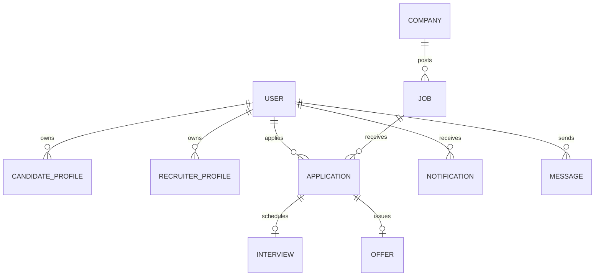

# AI-Powered Job Portal with Smart Resume Matching

An enterprise-grade recruitment platform built with the **MERN Stack** (MongoDB, Express, React 18, Node.js), powered by **Google Gemini API** (`@google/genai`), Socket.io WebSockets, vector candidate matching, and a sleek dark-mode SaaS UI.

---

## Architecture Diagram

```
                                  ┌──────────────────────────┐
                                  │   React 18 + Vite UI     │
                                  │ TailwindCSS + Redux +    │
                                  │ Framer Motion + Chart.js │
                                  └────────────┬─────────────┘
                                               │ HTTP REST / WebSockets
                                               ▼
                                  ┌──────────────────────────┐
                                  │    Node.js / Express     │
                                  │   REST API + Socket.io   │
                                  └────┬─────────────────┬───┘
                                       │                 │
                    ┌──────────────────┴───┐         ┌───┴─────────────────┐
                    │   MongoDB Database   │         │  Google Gemini API  │
                    │ (15 Collections Schema)│        │ (Parsing, Match, AI)│
                    └──────────────────────┘         └─────────────────────┘
```

---

## Entity-Relationship (ER) Diagram



---

## Database Schemas (15 Collections)

1. **User**: Authentication, Roles (`candidate`, `recruiter`, `admin`), Avatar, Verification, Refresh Tokens.
2. **CandidateProfile**: Headline, Bio, Resume PDF URL, Parsed Skills, Experience, Education, Projects, Social Links.
3. **RecruiterProfile**: Company ID, Designation, Department, Work Email.
4. **Company**: Name, Logo, Website, Industry, Location, Description.
5. **Job**: Title, Description, Required Skills, Salary Range, Job Type, Experience Level, Status.
6. **Application**: Job ID, Candidate ID, Resume Match Score %, Matched Skills, Missing Skills, Status.
7. **Skill**: Taxonomy tags & popular categories.
8. **Message**: Direct candidate-recruiter WebSockets chat.
9. **Notification**: Live real-time notification alerts.
10. **Interview**: Application ID, Date, Google Meet Link, AI Generated Question Bank.
11. **Offer**: Salary, Terms, Joining Date, PDF Offer Stream.
12. **Subscription**: Billing Tier & AI Credits.
13. **Chat**: AI Career Coach conversation logs.
14. **ResumeEmbedding**: Embeddings vector representation for semantic search.
15. **AuditLog**: Administrative action tracking.

---

## Quick Start & Installation

### 1. Prerequisites
- Node.js (v18+)
- MongoDB (Running locally or MongoDB Atlas URI)

### 2. Environment Variables
In `server/.env`:
```env
PORT=5000
NODE_ENV=development
MONGO_URI=mongodb://127.0.0.1:27017/ai_job_portal
JWT_SECRET=super_secret_jwt_access_key_2026_antigravity
CLIENT_URL=http://localhost:5173
GEMINI_API_KEY=your_google_gemini_api_key
```

### 3. Install & Seed
```bash
# Install root dependencies
npm install

# Seed initial database with demo accounts, jobs, & applications
npm run seed
```

### 4. Run Locally
```bash
# Start backend server & React Vite frontend concurrently
npm run dev
```
- **Frontend App**: `http://localhost:5173`
- **Backend API**: `http://localhost:5000`

---

## Default Testing Credentials

| Role | Email | Password |
|---|---|---|
| **Admin** | `admin@aijobportal.com` | `password123` |
| **Recruiter** | `recruiter@techcorp.com` | `password123` |
| **Candidate** | `candidate@gmail.com` | `password123` |

---

## Key Features & AI Capabilities

1. **Autonomous Resume Parsing**: Instant PDF extraction of skills, projects, and work history via `@google/genai`.
2. **Smart Resume Matcher**: Calculates 0-100% suitability match score, matched vs missing skills, and course recommendations.
3. **AI Job Description Generator**: Generates complete JDs from job title and required skills.
4. **Tailored Interview Question Bank**: Generates technical & behavioral questions customized to the candidate's exact resume.
5. **Real-time WebSockets**: Instant application status alerts, socket notifications, and candidate-recruiter messaging.
6. **PDF Offer Letter Generator**: Automated PDF stream creation for candidate job offers.
7. **SaaS Dashboard Suite**: Specialized dashboards for Candidate, Recruiter, and System Admin.
